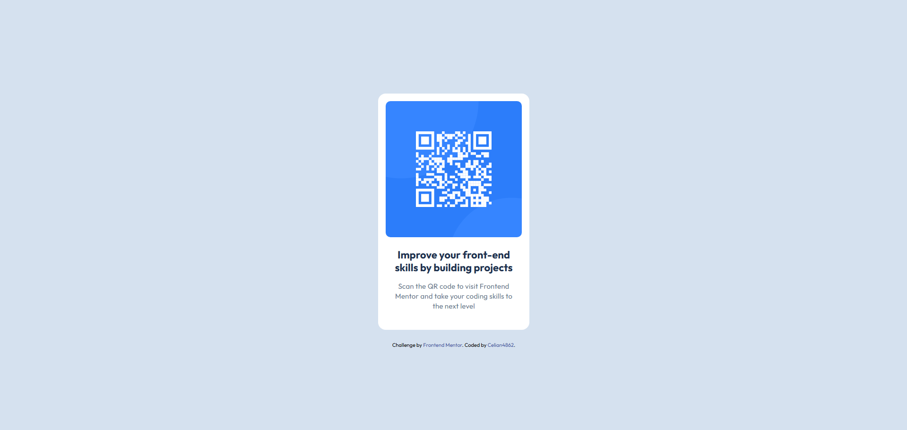

# Frontend Mentor - QR code component solution

This is a solution to the [QR code component challenge on Frontend Mentor](https://www.frontendmentor.io/challenges/qr-code-component-iux_sIO_H).

## Table of contents

- [Overview](#overview)
  - [Screenshot](#screenshot)
  - [Links](#links)
- [My process](#my-process)
  - [Built with](#built-with)
  - [What I learned](#what-i-learned)
  - [Continued development](#continued-development)
  - [Useful resources](#useful-resources)
- [Author](#author)

## Overview

### Screenshot

### Links

- Solution URL: [https://github.com/Celian4862/qr-code-component](https://github.com/Celian4862/qr-code-component)
- Live Site URL: [https://celian4682.github.io/qr-code-component](https://celian4682.github.io/qr-code-component)

## My process

### Built with

- Semantic HTML5 markup
- Flexbox
- [Tailwind CSS](https://tailwindcss.com/) - For styles

### What I learned

1. How to use Tailwind CSS
2. Effect of line-spacing attribute

### Continued development

As of 2025-02-07, I'd like to continue to focus on using semantic HTML elements more effectively as well as avoiding using text content elements when semantic elements fit better.

### Useful resources

- [Tailwind CSS documentation](https://tailwindcss.com/docs/) - I referred to it every time I needed to style an element.
- [Google Fonts (Outfit)](https://fonts.google.com/specimen/Outfit) - This is where I got the Outfit font.

## Author

- Website - [QR Code Component](https://celian4862.github.io/qr-code-component)
- Frontend Mentor - [@Celian4862](https://www.frontendmentor.io/profile/Celian4862)